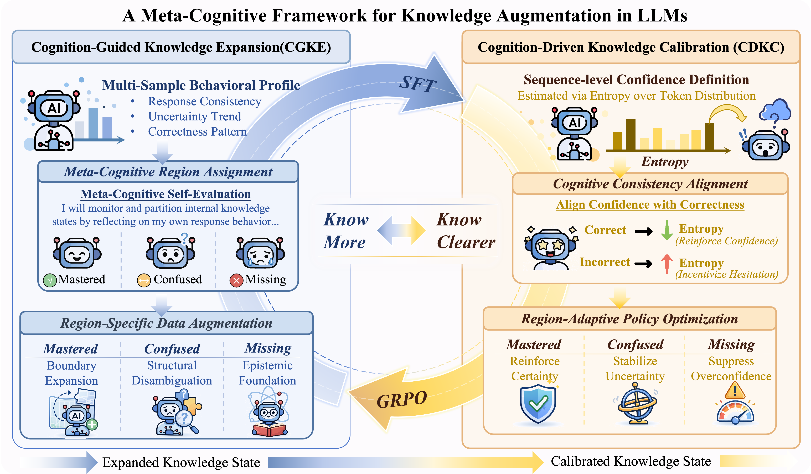

# **Know More, Know Clearer: A Meta-Cognitive Framework** for Knowledge Augmentation in Large Language Models

We are currently organizing the repository and will update it with the full paper, code, and resources soon. Stay tuned!

<p align="center">
  
</p>

## 📝 Citation

If you find this work useful, please cite our paper and give us a shining star 🌟:

```bibtex
@article{chen2026know,
  title={Know more, know clearer: A meta-cognitive framework for knowledge augmentation in large language models},
  author={Chen, Hao and He, Ye and Fan, Yuchun and Yan, Yukun and Liu, Zhenghao and Zhu, Qingfu and Sun, Maosong and Che, Wanxiang},
  journal={arXiv preprint arXiv:2602.12996},
  year={2026}
}
```

## 📬 Contact

If you have any questions, please contact us at methanechen@126.com.
